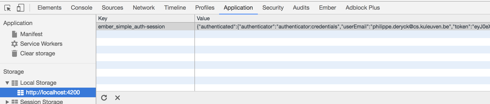
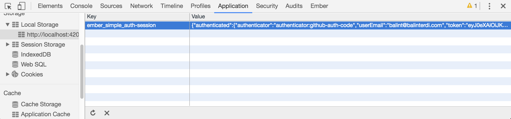
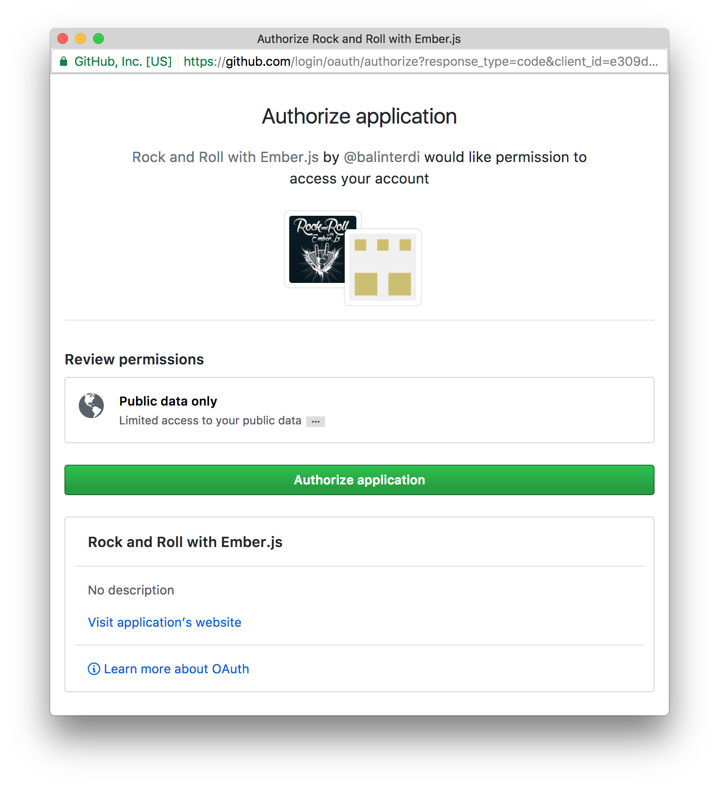
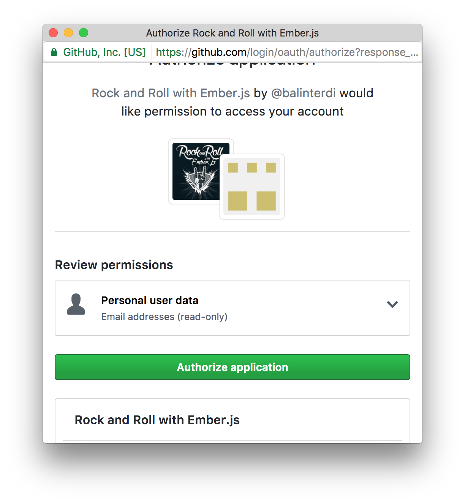

# Authentication with OAuth 2.0

The starting point of the *Rock & Roll* application already provides simple authentication with a username and a password. Session management is implemented with client-side JWT tokens. 

In this lab session, we will add support for OAuth 2.0 flows to the frontend application. The back end is already configured to serve all the authorization flows
we need during the workshop. We will show code snippets of the backend where relevant.


## Getting acquainted

Before we dive in, let's first see how the credential-based authentication is configured. You can load the authentication form by clicking the *Log in* button in the upper right corner.

You can find the code behind that form in `app/routes/login.js`. The relevant part is shown in the snippet below:

```js
// app/routes/login.js
signIn() {
  let controller = this.get('controller');
  let { email, password } = controller.getProperties('email', 'password');
  return this.get('session').authenticate('authenticator:credentials', email, password)
    .then(() => {
      controller.set('errorMessage', '');
    })
    .catch((error) => {
      controller.set('errorMessage', error.error || error);
    });
}
```

This is the action that will be triggered upon form submission. It will invoke an *Ember Simple Auth (ESA)* authenticator (`credentials`), and send it the email and password coming from the input fields.

The following code snippet shows what an ESA authenticator does.

```js
// app/authenticators/credentials.js

authenticate(username, password) {
	return this.get('ajax').post('/token', {
	  headers: {
	    'Accept': 'application/vnd.api+json',
	    'Content-Type': 'application/vnd.api+json',
	  },
	  data: JSON.stringify({
	    username,
	    password
	  })
	}).then(({ user_email: userEmail, token }) => {
	  return {
	    userEmail,
	    token
	  };
	});
}
```

The `authenticate` method is called by ESA, and receives the
parameters we passed in to the session's authenticate call previously.

The method uses these parameters to send a POST request to the API endpoint that handles authentication. The API responds with a `user_email` and `token`. We camelize these keys and return the object for ESA to set it as authenticated data (in
`session.data.authenticated`).

Fill out the registration form with the credentials you created during the setup phase, and inspect these steps in *Chrome*'s network console. Here, you can also observe that ESA stores the authentication status in *localStorage*, as shown below.



The API expects us to include the token in subsequent requests to authorize
them. ESA offers an abstraction to easily enable such behavior: the authorizer. Below is a code snippet from the custom JWT authorizer:

```js
// app/authorizers/jwt.js
import Ember from 'ember';
import Base from 'ember-simple-auth/authorizers/base';

const { isEmpty } = Ember;

export default Base.extend({
  authorize(data, block) {
    let token = data['token'];

    if (!isEmpty(token)) {
      block('Authorization', `Bearer ${token}`);
    }
  }
});
```

This authorizer sets the token as the Authorization header in all outgoing requests. The only thing left is to tell ESA to actually use the authorizer, which is achieved by specifying the authorizer in the application adapter. The relevant code is shown below:

```js
// app/adapters/application.js
import JSONAPIAdapter from 'ember-data/adapters/json-api';
import DataAdapterMixin from 'ember-simple-auth/mixins/data-adapter-mixin';

export default JSONAPIAdapter.extend(DataAdapterMixin, {
  authorizer: 'authorizer:jwt',
});
```

The `DataAdapterMixin` provided by ESA is the one that connects the above
defined authorizer with the Ember Data adapter. The `authorizer` property tells
ESA which authorizer to use.

So now that you are acquainted with the application, it's time to dive into the OAuth 2.0 flows.

## Running flows with Torii

Torii provides a clean set of abstractions (providers, adapters and the
session) to implement the authorization flows in your application. It handles
the whole redirection flow process, and automatically opens and closes the popup.

On top of that, it also provides implementations for numerous 3rd party OAuth2 providers, like Google, Facebook, Twitter, Github, etc., so working with these providers becomes a breeze. Its flexible architecture makes it easy to implement
providers that are not bundled into the add-on.

Integrating a provider can be as easy as just configuring the keys and redirect
URLs:

```js
// config/environment.js

module.exports = function(environment) {
  var ENV = {
    torii: {
      providers: {
        'github-oauth2': {
          clientId: 'e309dba06c2f82915da8',
          redirectUri: 'http://localhost:4200/oauth2callback'
        },
      }
    },
    (...)
  };
  (...)
};
```

We have preconfigured these client IDs for the *Rock & Roll* application, so the providers are ready to be used. 

## Integrating Torii with ESA

Torii offers session management, but it is optional to use. Therefore, Torii can be integrated very nicely with ESA. Essentially, Torii manages the whole OAuth 2.0 flow, and ESA handles the authentication status and session management.

This allows us to re-use the existing session management mechanism, and ensures that we do not have to change other parts of the application.


## Implicit Grant flow (with Google)

Let's tackle our first OAuth 2.0 flow. We're going to implement an *implicit grant* flow with Google. Later, we'll integrate support for the *authorization code* flow with Github and Facebook.


First, we're going to give you a bit of information to get started. At first, it will be a challenge, so this is your moment to shine. Dive right in, and try to figure out how to add the OAuth 2.0 flow to the application. Should you get stuck, make sure you let us know!

The main interface of ESA is the `session` service. To initiate the
authentication process, you call `authenticate` on it, passing in the name of
the `authenticator` and any parameters it needs. For example:

```js
//Calling our custom google authenticator
this.get('session')
  .authenticate('authenticator:google-implicit-grant', 'google-oauth2-bearer');

//Calling our custom github authenticator
this.get('session')
  .authenticate('authenticator:github-auth-code', 'github-oauth2');
```

The authenticator you reference here needs to be created and implemented. The easiest way to create an authenticator is
by using the generator provided by the add-on:

    $ ember g authenticator google-implicit-grant

You can also pass the `base-class` option that will make the generated
authenticator extend that base class. ESA provides the `torii` authenticator to
integrate with Torii so the command becomes:

    $ ember g authenticator google-implicit-grant  --base-class=torii

After creating an authenticator, you end up with a file like the one shown below. 

```js
// app/authenticators/google-implicit-grant.js
import Torii from 'ember-simple-auth/authenticators/torii';

export default Torii.extend({
  torii: Ember.inject.service('torii')
});
```

When you call `session.authenticate` on a Torii authenticator, the second
parameter should be the name of the Torii provider that you want to use
(`google-oauth2-bearer` in the above example). You can list the full list
[here][list-of-torii-providers].

What you return from the `authenticate` method of the `authenticator` will be
set into the ESA session and persisted in your browser to be restored later:



In the current application, this return value should be an object with the
following keys:

    userEmail: the `user_email` value received from the backend
    token: the `token` value received from the backend
    provider: the name of the Torii provider (e.g `google-oauth2-bearer`)
    
You can get this information from the backend, by calling the `/tokens/validate` endpoint. This endpoint will validate the access token (or authorization
code) and return you the user's email and the JWT token. This info can be used to let ESA handle the rest of the session.

The full spec of the endpoint is shown below:

    POST /tokens/validate

    Request headers (need to be present on every API call):
      'Accept': 'application/vnd.api+json'
      'Content-Type': 'application/vnd.api+json'
    Request payload:
      code: the authorization code (required for the authorization code flows)
      access_token: the token you received from Google (required for the implicit grant flow)
      provider: the name of the 3rd party provider, 'google', 'github' or 'facebook' (required)
    Response:
      user_email: the email of the authenticated user
      token: the JWT token used as a session identifier with the backend


**Exercise:** Implement the implicit grant flow by defining the `authenticate`
method of this authenticator, and by adding a button to use this new authentication method.

### Hint

Calling `this._super` in your authenticator's `authenticate` method will execute the
entire OAuth 2.0 flow with Google and return an object that has an
`authorizationToken` and `provider` parameter.

The `authorizationToken` is the one you have to exchange for user information
(email and token)  with the backend, as discussed before.

```js
// app/authenticators/google-implicit-grant.js
import Torii from 'ember-simple-auth/authenticators/torii';

export default Torii.extend({
  torii: Ember.inject.service('torii'),

  authenticate() {
    return this._super(...arguments)
      .then((params) => {
        // the actual Google access token can be accessed as
        // `params.authorizationToken.access_token`
        // the Torii provider, like `google-oauth2-bearer`
        // is in `params.provider`
        //
        // TODO: Send access token to back-end to
        // get a session token and the user email back
      });
  },
});
```

## Restoring the session

Restoring the session is what happens when you already have a persisted session
in your browser and you reload the application. If the implementation is
correct, you should see the exact state before you reloaded the app.

ESA already stores the session information in localStorage. So to implement a session restore feature, you need to add the `restore` method in the authenticator. The method receives as its only parameter the deserialized
session data that had been persisted earlier.

**Exercise:** Implement restoring the session after you've successfully logged in.

### Hint

With Torii adapters, the method needs to call its parent implementation (to do
some housekeeping) which returns a promise. Once the promise resolves, we need
to return the data we received as parameter.

### Solution

```js
// app/authenticators/google-implicit-grant.js
import Ember from 'ember';
import Torii from 'ember-simple-auth/authenticators/torii';

export default Torii.extend({
  restore(data) {
    return this._super(...arguments)
      .then(() => {
        return data;
      });
  }
});
```

## Authorization code flow (with Github or Facebook)

Implementing this scenario is very similar to what we already have implemented
with Google. The main difference is that instead of receiving the access token
from the provider at the end of the flow, the browser receives an authorization
code. It then needs to exchange that code for an access token with the back-end.

**Exercise:** Implement signing in with either Github or Facebook. For Github,
the name of the Torii adapter is `github-oauth2`, for Facebook its `facebook-oauth2`.

### Github: Public vs. private email address

On Github, you can choose to [keep your email address private.][github-email-privacy].

To make sure the email can always be read from the user's profile, the OAuth 2.0 client 
application needs to explicitly ask for [the 'user:email' scope][github-scopes]. If this permission is not present in the request, the user sees the following permission dialog:



Setting the scopes (permissions) that the OAuth app asks for needs to be
configured in Torii. See [the docs][torii-docs] on how this should be done.

Once you have added `user:email` to the scope, the user will see the following permission dialog, which explicitly asks permission to access the email address.



From now on, the backend will have access to the email information, by accessing the [email endpoint][github-email-endpoints].

Here is how this is currently implemented in the back-end:

```ruby
def get_github_email(access_token)
  conn = Faraday.new(:url => 'https://api.github.com/user/emails')
  json_response = conn.get do |request|
    request.headers['Authorization'] = "token #{access_token}"
  end
  response = JSON.parse(json_response.body)
  response.first['email']
end
```


## How the backend uses OAuth 2.0 for authentication

When an access token (or authorization code) is sent to the back-end, it hits
the appropriate endpoint to access information from the user who authorized the
OAuth application. In our case, that means fetching the user's email.

It then uses this email address to link user accounts together. So if you
registered an email address and then you authorize the Google OAuth app to
access the same email address, these accounts are considered the same (and
that's why you see the bands and songs previously created).

[list-of-torii-providers]: https://github.com/Vestorly/torii/tree/master/addon/providers
[github-email-privacy]: https://help.github.com/articles/keeping-your-email-address-private/
[github-scopes]: https://developer.github.com/v3/oauth/#scopes
[github-email-endpoints]: https://developer.github.com/v3/users/emails/#emails
[torii-docs]: https://github.com/Vestorly/torii#configuring-a-torii-provider
