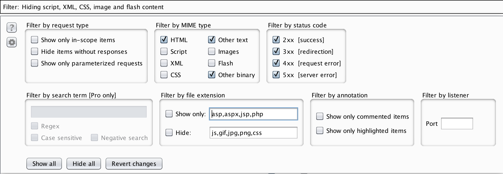
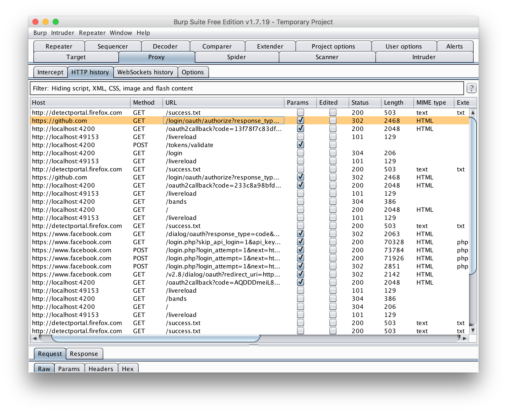
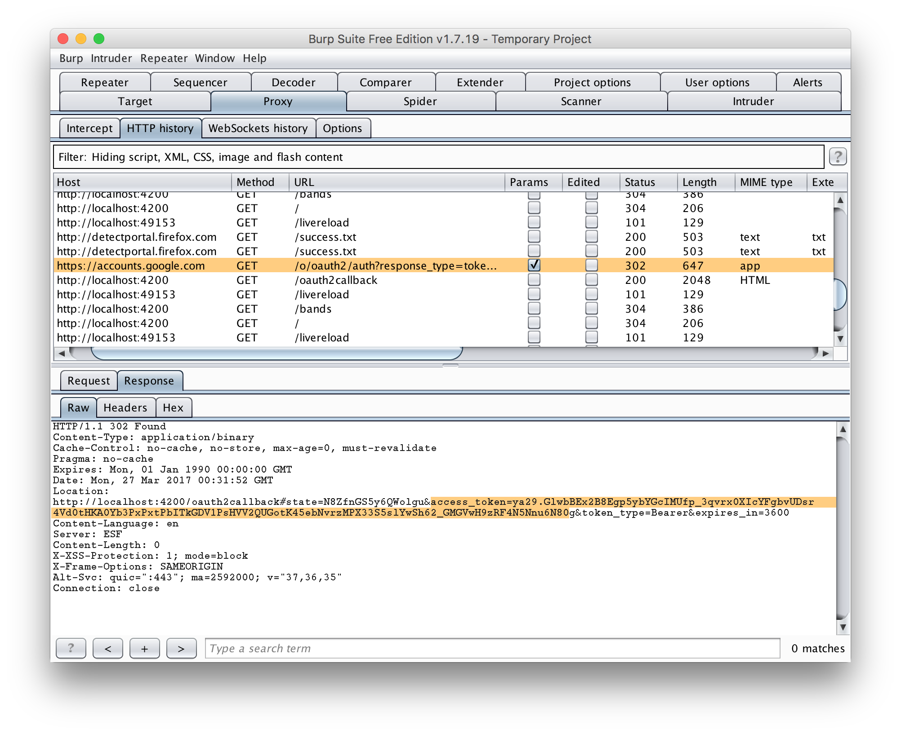
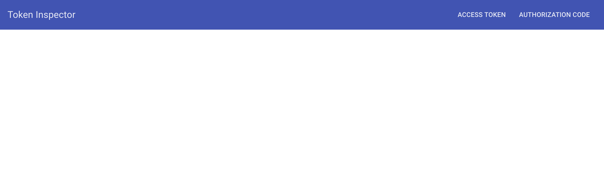
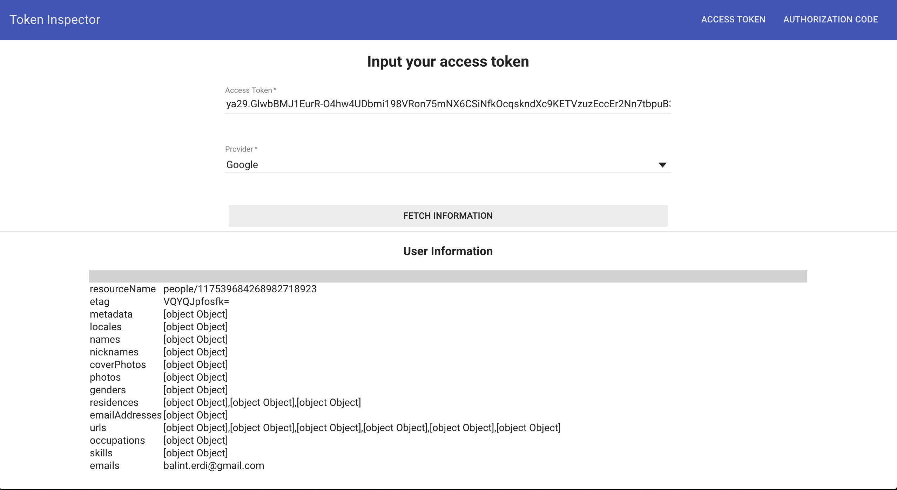
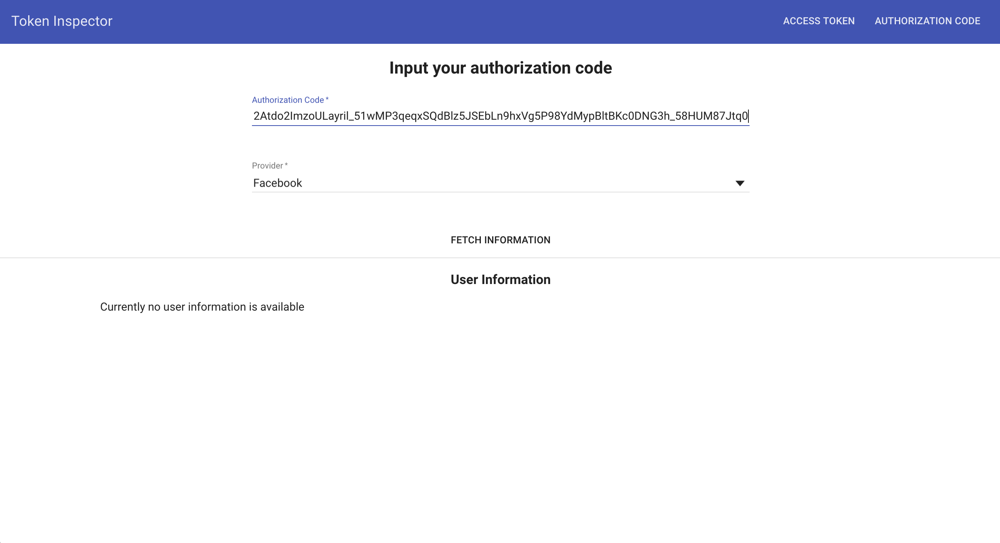
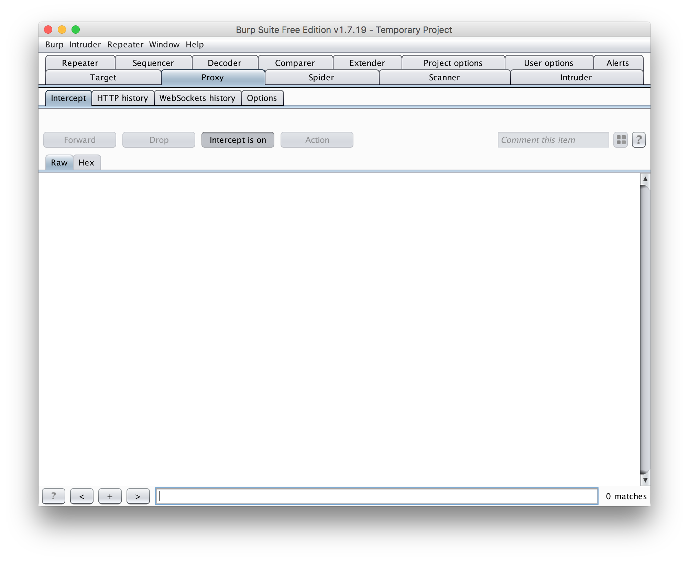
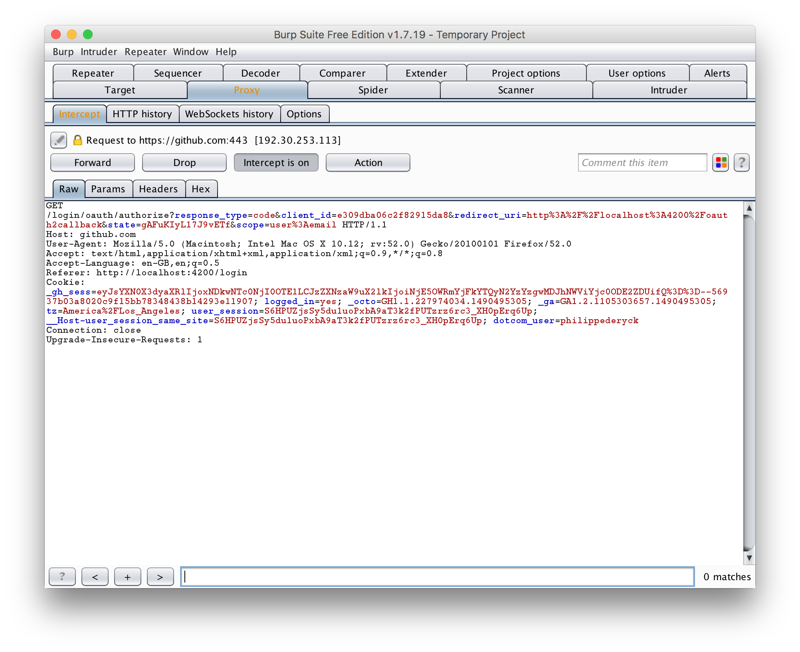
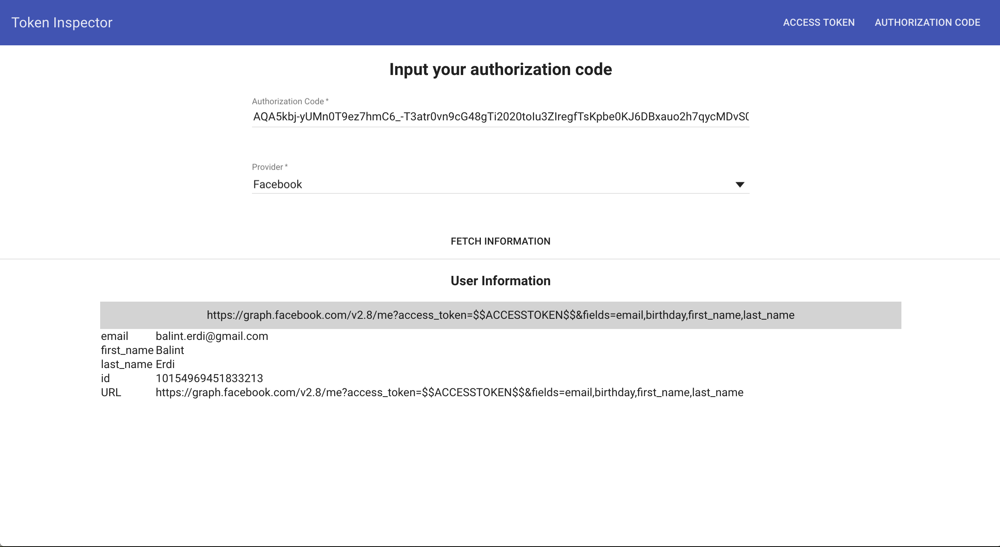
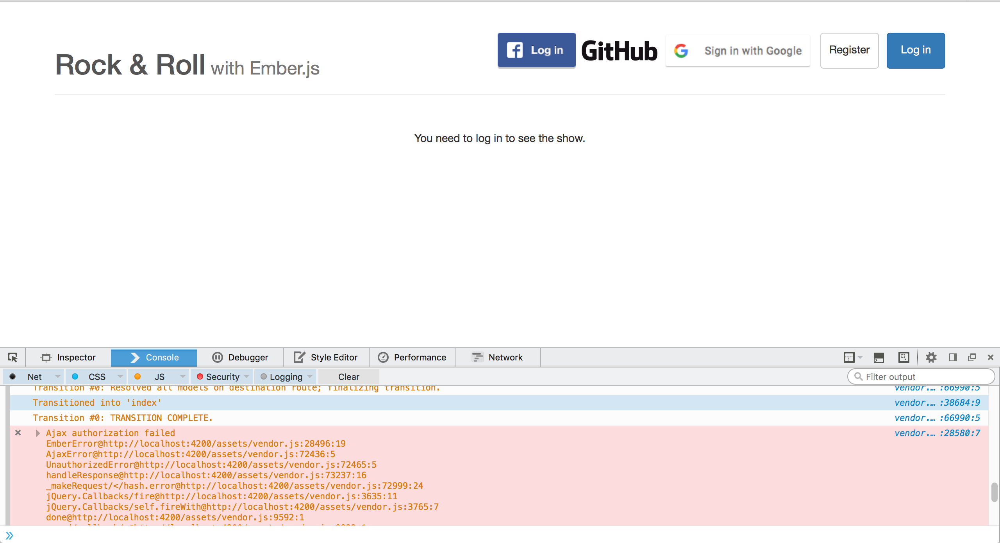

# Security properties of OAuth 2.0 flows

Many OAuth 2.0 tutorials advise the use of the *Implicit Grant* flow, also known as the *two-legged* flow. This flow is straightforward, and seems a lot easier to implement than the *Authorization Code* flow, also known as the *three legged* flow.

In this lab session, we dissect both *Implicit Grant* flow and the *Authorization Code* flow, and show you the specific security properties for each of these flows.

<<<<<<< Updated upstream
Additionally, we will discover how it all comes down to the *access token*, which plays a crucial role in every OAuth 2.0 flow. This token is known as a *bearer token*, which essentially means that possession of the token is sufficient to gain access to a protected resource.
=======
Additionally, we will discover how it all comes down to the *access token*, which plays a crucial role in every OAuth 2.0 flow. This token is known as a *bearer token*, which essentially means that posession of the token is sufficient to gain access to a protected resource.
>>>>>>> Stashed changes


## One access token to rule them all

The first scenario illustrates the power of the *access token*. We will steal the token from the *Implicit Grant* flow in the *Rock & Roll* application, and use it to access the protected resources directly.

### Stealing the token

Stealing the token can be done in various ways. Think about eavesdropping on the network, an XSS attack, a vulnerable or malicious browser extension, ...

To avoid complicating this workshop even further, we're simply going to grab the *access token* from the network requests we already logged in *Burp*. Follow the steps below to get hold of an *access token*.

1. In *Burp*'s main window, select the *Proxy* tab
2. Here, you will see a list of requests that *Burp* has intercepted
3. To narrow down the list we can adjust the filter settings. Click on the white bar that says *"Filter: ..."*, and adjust the checkboxes as shown on the image below.



Now, you should see a list like the one shown below.



In this list, look for a request coming from Google, or going to the `/tokens/validate` endpoint. Note that you can inspect contents of both the request and response in the bottom pane. Grab the *access token* and store it in a file for later use

The screenshot below shows you one example of where to find the *access token*.




### Using the stolen access token

The access token we stole was issued explicitly for the *Rock & Roll* application. Unfortunately, there is no way to restrict its use in an *Implicit Grant* flow. We have created a simple *Token Inspector* application, that allows you to simulate the abuse of an *access token*.

The application is available at https://oauth-token-inspector.herokuapp.com. If everything works correctly, you should see something like the screenshot below.



You can give the application an *access token* for one of the supported providers. The application will contact the APIs and retrieve some information with this *access token*. If you're worried about the security of your account information, you'll be pleased to hear the everything runs on the client-side, and tokens are sent nowhere else but to their corresponding providers.

So, let's grab the *access token* you saved to a file earlier, and plug it into the *Access Token* window of the *Token Inspector*.

As you can see, we can easily retrieve user-specific information using this *access token*. In this case, it is obvious that the *Token Inspector* application is not the one that created or requested the *access token*.



To illustrate the importance of keeping your scope limited, head back to the *Rock & Roll* application and modify the scope of the Google provider. You can find the documentation of Google's scopes here: [https://developers.google.com/identity/protocols/googlescopes](https://developers.google.com/identity/protocols/googlescopes). One example that the *Token Inspector* actually tries is the *https://www.googleapis.com/auth/contacts.readonly* scope.

From this scenario, you can clearly conclude that the *access token* is a bearer token, and that anyone holding it can use it to access the protected resources.
That is exactly one of the reasons why the scope of a requested *access token* should be as limited as possible.

### Explicitly checking the client ID

To prevent such attacks as shown above, *access tokens* coming from the frontend should be validated before they can be used. This is something that the backend needs to do explicitly. In the *Rock & Roll* application, the following code is responsible for verifying the *access token* coming from Google.

```
 def validate_google_token(token)
    response = Faraday.get
      "https://www.googleapis.com/oauth2/v3/tokeninfo?access_token=#{token}"
    return unless response.status == 200

    response = JSON.parse(response.body)
    if response['aud'] != ENV['GOOGLE_CLIENT_ID']
      render json: {}, status: 401
    end
    response['email']
  end
```

After the token metadata has been retrieved and the associated client ID has been verified against the backend's client ID, the token can be used for actually accessing the protected resources.

## Access tokens vs authorization codes

__*Please run this scenario with Facebook. Github implements additional security measures, which makes this scenario impossible.*__

In the *Authorization Code* flow, the client receives an *authorization code* instead of an *access token*. The backend application can exchange the *authorization code* for an *access token*, which it can use to access the protected resources.

Let's investigate the security properties of such an *authorization code*. Just like before, we're going to grab an *authorization code* from the logged requests in *Burp*, following the steps below:

In *Burp*'s list of HTTP requests, look for a request to the `/tokens/validate` endpoint with an *authorization code* in the body.

Now, head back to the *Token Inspector* application, and see if we can get an *access token* with this *authorization code*. Go to the *Authorization Code* window, fill out the code just grabbed and select the provider.



Here, you already see one major difference compared to the *access token*. An *authorization code* can only be used once, and this token has already been used in the flow where we captured it from.

A second difference is hiding under the hood of the *Token Inspector*. To contact the endpoints to exchange an *authorization code* for and *access_token*, you need to possess the *client ID* and *client secret*. This means that in principle, only the backend can make these calls.

__*In the case of the Token Inspector, we have added the client IDs and client secrets to the client application. This is not a good security practice, and is only done for demonstration purposes!*__

### Exchanging an authorization code for an access token

__*Please run this scenario with Facebook. Github implements additional security measures, which makes this scenario impossible.*__

Let's see what happens if we manage to steal a fresh *authorization code*. Would we be able to get an *access token* with it?

For this, we will use *Burp* to intercept requests, and stop the flow once we have obtained an *authorization code*. Follow the steps below to capture a fresh *authorization code*:

1. Open the *Rock & Roll* application and make sure you're logged out
1. In *Burp*'s *Proxy* tab, choose for *Intercept* and make sure interception is turned on (see screenshot below)
2. Start the *Authorization Code* flow with Facebook
3. The window will stay blank, because *Burp* has stopped the request, and is waiting for confirmation to send it out
3. Open *Burp* and click the *Forward* button, as shown below
4. Keep going through the flow and forwarding requests, until you see the request containing the *authorization code*
5. **Do not forward this request**, but simply copy the *authorization code*. Leave the window untouched, we will come back to this later.




With the freshly obtained *authorization code*, go back to the *Token Inspector*, and enter it into the inspection field. As you can see, a fresh token can be exchanged for an *access token*, as long as you possess the *client ID* and *client secret*.



__*In the case of the Token Inspector, we have added the client IDs and client secrets to the client application. This is not a good security practice, and is only done for demonstration purposes!*__

Use the *access token* in the *Token Inspector* application to actually retrieve some information about the user.

Now, go back to the intercepted request in *Burp*, and hit the *Intercept On* button. This will turn interception off again, and forward all pending requests.

The *authorization code* will now be sent to the backend, which will try to exchange this for an *access code*. This will result in an error, since have already used this *authorization code* in the previous steps.



